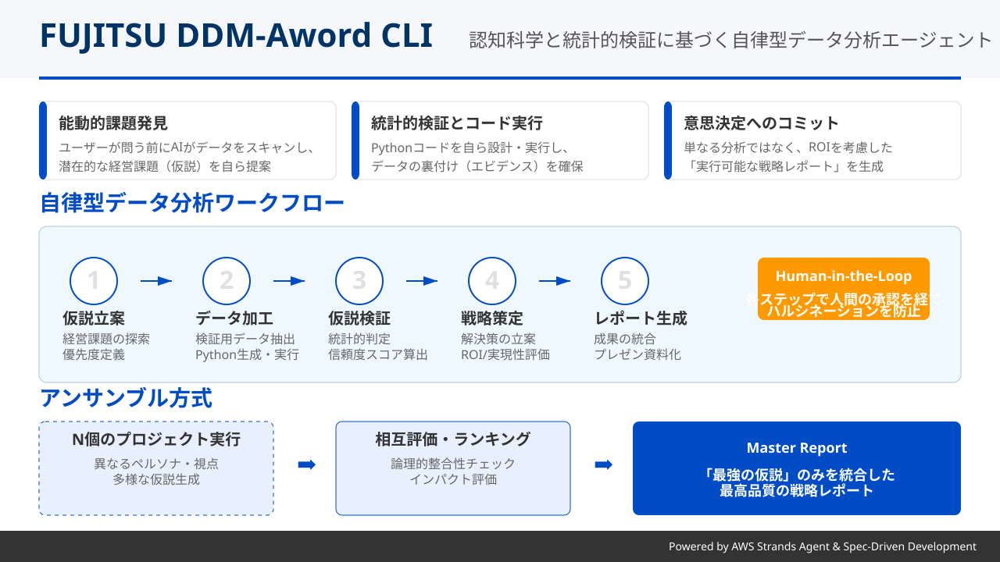
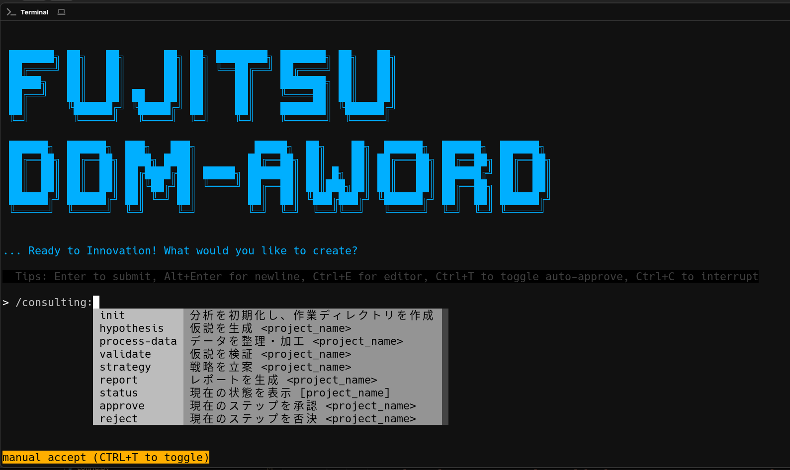
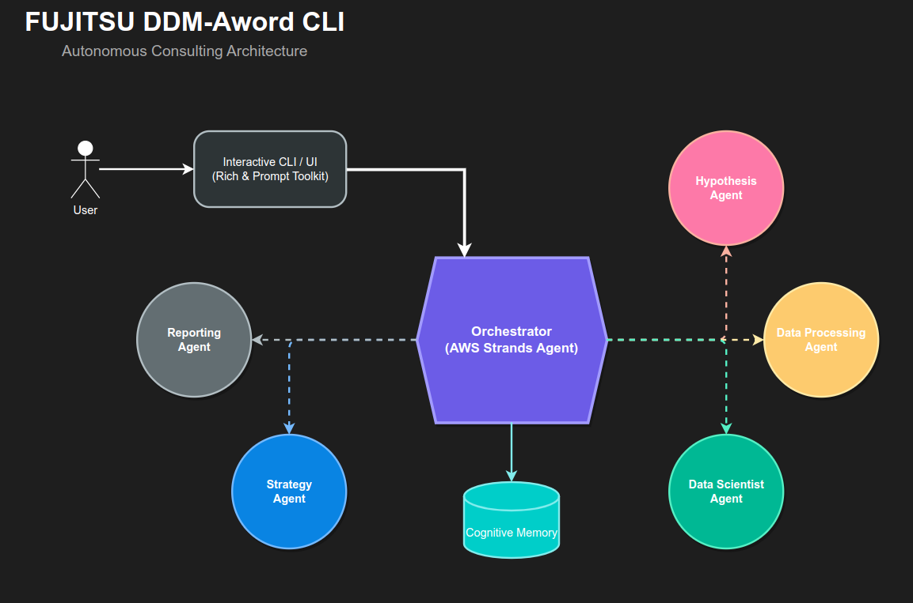

# AIデータドリブン・コンサルティングCLI：FUJITSU DDM-AWord  CLI
## 〜 認知科学と統計的検証に基づく自律型経営支援エージェント 〜

**本ドキュメントでは、今回のAIデータドリブンコンペティションにおける課題解決のために独自開発し、実際の分析に活用した対話型AIエージェントツール「FUJITSU DDM-AWord CLI」について解説します。**

## 1. エグゼクティブサマリー

本ツールの「コンサルティング機能」は、単なる質疑応答システムではありません。「仮説立案 → データ加工 → 統計的検証 → 戦略策定 → レポート生成」という、実際の人間のコンサルタントが行う一連の思考プロセスを、複数の専門AIエージェントが協調して自律的に実行するシステムです。

認知科学に基づく高度なメモリモデルと、厳密なデータ検証プロセスを組み合わせることで、**「データの裏付け（エビデンス）に基づいた、実行可能な経営戦略」** を導き出します。

---

## 2. なぜ FUJITSU DDM-AWord  CLI なのか？

多くのAIツールは「ユーザーの質問に答える」あるいは「指示されたコードを書く」ことに留まっています。しかし、FUJITSU DDM-AWord  CLI は以下の点で根本的に異なります。

*   **能動的な課題発見**: ユーザーが課題を定義する前に、AIがデータをスキャンし、潜在的な経営課題（仮説）を自ら提案します。
*   **確率的アプローチによる多角的な仮説探索**: AIの確率的な生成能力を活用することで、人間や従来のルールベース分析では見落としがちな「非自明な相関」や「意外性のある切り口」を含む、多様な仮説を広範囲に探索します。
*   **コード実行による自己検証**: 単なるテキスト生成ではなく、**Pythonコードを自ら設計・実装・実行**してCSVデータを加工・分析します。これにより、提案された仮説がデータ的に正しいかを統計的に裏付けます。
*   **意思決定へのコミット**: 単なる分析結果の羅列ではなく、「意思決定表」や「アクションプラン」を含む、ビジネスの現場で即座に使える戦略を立案します。
*   **長期的な文脈理解**: 認知科学に基づくメモリモデルにより、会話が長くなっても過去の経緯や文脈を忘れず、一貫性のある提案を継続します。

### 既存ツールとの比較

| 機能・特徴 | 一般的なAIチャットボット | FUJITSU DDM-AWord CLI |
| :--- | :--- | :--- |
| **課題発見** | ユーザーが質問する必要あり | **AIが能動的に提案** |
| **データ分析** | コードを提示するのみ | **自らコードを実行して検証** |
| **根拠** | 学習データに基づく確率的回答 | **実データに基づく統計的裏付け** |
| **出力** | テキスト回答 | **意思決定可能な戦略レポート** |

---

## 3. 開発環境とコアテクノロジー：AWS Strands Agent によるフルスクラッチ開発

本システムは、既存のチャットボット作成ツールやNo-Codeプラットフォームを使用せず、AWSの先進的なエージェントフレームワーク **「Strands Agent」** を基盤として、Pythonでフルスクラッチ開発しました。

### 技術スタック
*   **言語**: Python 3.10+
*   **コアフレームワーク**: **AWS Strands Agent SDK** (v0.2.0+)
    *   AWSが提供する最新のエージェント構築フレームワークを採用。
    *   ブラックボックス化された既存のエージェント機能に頼らず、思考ループやツール使用のロジックを独自に実装することで、高度な制御と透明性を実現しています。
*   **LLM基盤**: マルチモデル対応 (Amazon Bedrock, OpenAI, Anthropic, Google Gemini)
*   **データ処理**: pandas, numpy (高速な数値計算とデータ操作)
*   **可視化**: matplotlib, seaborn (出版品質のグラフ生成)
*   **UI/UX**: rich, prompt-toolkit (リッチなターミナル体験)

### フルスクラッチ開発の意義
Strands Agent のプリミティブな機能を活用し、**「認知科学に基づくメモリモデル」** や **「Human-in-the-Loop ワークフロー」** をコードレベルでゼロから設計・実装しました。これにより、一般的なAIエージェントでは困難な「長期的な文脈維持」や「複雑なタスクの自律実行」を可能にしています。

---

## 4. 設計思想：Spec駆動開発 (SDD) の応用とAIネイティブUX

本ツールの設計および操作プロセスは、**AWS Kiro**、**cc-sdd**、**GitHub Copilot Spec Kit** などで提唱されている最先端のAI開発手法 **「Spec駆動開発 (Spec-Driven Development)」** の哲学を強く反映しています。

### Spec駆動のコンサルティングプロセス
ソフトウェア開発における「Spec（仕様）→ Code（実装）」の流れを、経営分析における**「Hypothesis（仮説）→ Validation（検証）」**に適用しました。曖昧な課題を明確な「Spec（仮説ファイル）」として定義し、それをAIが実装（データ検証）していくアプローチをとることで、手戻りのない確実な分析を実現しています。

### cc-sdd スタイルのスラッシュコマンドUX
特に **[cc-sdd](https://github.com/gotalab/cc-sdd)** (cc Spec-Driven Development) の影響を強く受けており、複雑なGUIを廃した **「CLI + スラッシュコマンド」** による対話型プロセスを採用しています。

*   **明確なフェーズ管理**: `/consulting:hypothesis` → `/consulting:validate` のように、コマンドベースで明確にフェーズを切り替えることで、AIとの協働における「コンテキストの汚染」を防ぎます。
*   **開発者体験 (DX) の重視**: エンジニアやデータサイエンティストが慣れ親しんだターミナル操作で完結するため、既存のワークフローにスムーズに統合可能です。

---

## 5. データドリブン・コンサルティング・ワークフロー

5つの専門エージェントがリレー形式でタスクを遂行します。各ステップは **Human-in-the-Loop** （人間の承認）を経て進行するため、AIの幻覚（ハルシネーション）を防ぎ、納得感のある成果物を生成します。

### Step 1: 仮説立案 (Hypothesis Generation)
*   **担当**: 経営コンサルタント・仮説立案専門家
*   **機能**: 売上、人事、顧客データなどのCSVを横断的にスキャン。10年後の市場予測などの外部知識も加味し、「直近2〜3年で改善可能な」経営課題の仮説をリストアップします。
*   **特徴**: 単なるデータの羅列ではなく、「優先度」「根拠指標」「検証に必要なデータ項目」まで定義します。

### Step 2: データ加工 (Data Processing)
*   **担当**: データエンジニア
*   **機能**: 提唱された仮説を検証するために必要なデータを、元データから抽出・加工します。
*   **技術**: セキュリティと再現性を担保するため、**「CSVを直接読み込むのではなく、データ抽出用のPythonコードを生成・実行する」** という高度な手法を採用しています。

### Step 3: 仮説検証 (Hypothesis Validation)
*   **担当**: データサイエンティスト
*   **機能**: 加工されたデータに対し、回帰分析、相関分析、時系列分析などの統計的手法を適用。
*   **特徴**: 「なんとなくそう見える」ではなく、**「信頼度（Confidence Score）」** と共に、仮説の成立/不成立を厳密に判定します。

### Step 4: 戦略立案 (Strategy Planning)
*   **担当**: 戦略コンサルタント
*   **機能**: 検証によって「真」であることが証明された課題に対してのみ、具体的な解決策を立案します。
*   **特徴**: インパクトと実現可能性（Effort）の2軸で評価し、ROI（投資対効果）を意識した優先順位付けを行います。

### Step 5: レポート生成 (Report Generation)
*   **担当**: レポーティング専門家
*   **機能**: 全工程の成果を統合し、経営層向けの最終レポートを作成します。
*   **特徴**: **Quarto互換のMarkdown** で出力され、そのままプレゼンテーション資料として利用可能な品質です。

---

## 6. アンサンブル・コンサルティング方式による「最強の仮説」の生成

本発表では、単一のコンサルティングプロジェクトだけでなく、複数のコンサルティングプロジェクトを生成し、その結果を統合する「アンサンブル方式」で、より堅牢で説得力のある戦略を作成する方式を取りました。

### アンサンブル方式概要

1.  **N個のコンサルティングプロジェクト生成**: コンサルティングプロジェクトを複数（推奨N=3〜5）生成します。各プロジェクトは独立した乱数シードと「思考の癖（Persona）」を持ち、異なる視点から仮説（N×M個）を生成・検証します。
2.  **カテゴリ分類**: 生成された仮説を、ビジネス、人材育成、財務改善などのテーマごとに分類します。
3.  **総当たり評価とランキング**: 分類された仮説群の中で、AIが相互評価を行い、論理的整合性とインパクトの観点から順位付けを行います。
4.  **マスターレポート生成**: 最上位にランクインした「最強の仮説」のみを抽出し、1本の統合レポート（Master Report）にまとめ上げます。

### メリット：単一実行との比較

| 比較項目 | 単一実行 | アンサンブル方式 |
| :--- | :--- | :--- |
| **視点の多様性** | 1つの視点に依存（バイアスリスクあり） | **複数のペルソナ**による多角的な視点 |
| **仮説の質** | 生成されたものが全て | 相互評価を勝ち抜いた**「最強の仮説」**のみ |
| **カバレッジ** | 局所的な最適解になりがち | **網羅的**な課題探索が可能 |
| **信頼性** | AIのハルシネーションの影響を受けやすい | **多数決とクロスチェック**で排除 |

*   **バイアスの排除**: 単一の実行では避けられない「AIの思い込み」や「視野の偏り」を、多数決と相互評価によって排除します。
*   **質の向上**: 複数の視点からの検証を経ることで、より堅牢で説得力のある戦略が生き残ります。

---

## 7. 結論：AIデータドリブンコンペにおける優位性

FUJITSU DDM-AWord  CLI は、単にLLMをAPIで叩くだけのツールではありません。

1.  **自律性**: 課題発見から解決策の提示までをエンドツーエンドで実行できる。
2.  **信頼性**: 統計的検証プロセスを内包し、エビデンスに基づいた回答のみを出力する。
3.  **実用性**: 認知科学に基づくメモリモデルにより、複雑で長期的な文脈を理解できる。

これは、**「AIが人間のパートナーとして、高度な知的生産活動（コンサルティング）を代替・拡張できる可能性」** を示す、具体的な実装例です。

---

## 8. 関連リンク・参考文献

*   **AWS Kiro**: <https://kiro.dev/>
*   **cc-sdd (Chat-Centric Spec-Driven Development)**: <https://github.com/gotalab/cc-sdd>
*   **GitHub Copilot Spec Kit**: <https://github.com/github/spec-kit>

