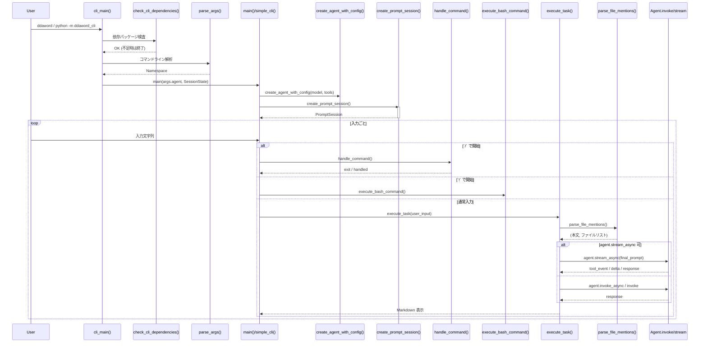

# ddaword_cli 全体詳細設計

## 1. システム概要
- 目的: 端末上で AI エージェントと対話しながら開発支援を行う CLI を提供する。
- 技術スタック: Python + prompt_toolkit (入力 UI) + Rich (出力 UI) + Strands Agent (LLM 連携) + uv パッケージ管理。
- 実行形態: `ddaword` コマンド、または `python -m ddaword_cli`。メインロジックは `ddaword_cli/main.py` に集中させ、他モジュールは役割ごとに分割。

## 2. モジュール構成と責務
| モジュール | 主要責務 |
| --- | --- |
| `main.py` | 依存チェック、引数解析、CLI ループ統括、エージェント起動 |
| `config.py` | 環境変数読み込み、色設定、共有 `console`、`SessionState`、モデル生成 |
| `agent.py` | エージェント永続ディレクトリ管理、システムプロンプト生成、Agent インスタンス化 |
| `commands.py` | `/` 系コマンド処理、`!` 系 Bash 実行ラッパー |
| `input.py` | prompt_toolkit セッション、補完、キーバインド、ツールバー、`@path` 解析 |
| `execution.py` | ファイル参照付きプロンプト生成、ストリーミング処理、Rich 出力 |
| `ui.py` | `help`／`/help` 画面のレンダリングとショートカット案内 |
| `__init__.py` / `__main__.py` | CLI エントリーポイント公開、`cli_main` 呼び出し |
| `tests/test_agent.py` | エージェント管理機能の回帰テスト |

## 3. 呼び出し順序 (シーケンス図)
ユーザーが CLI を起動し、1 回のプロンプトを実行するまでの Python 関数呼び出し順を以下の Mermaid シーケンス図で示す。

## 4. ランタイムフロー詳細
1. **依存確認**: `check_cli_dependencies()` が `rich` などの import を試行し、未インストール時は `uv sync` を案内して終了。
2. **引数処理**: `parse_args()` が `list` / `help` / `reset` の各サブコマンドと `--agent`, `--auto-approve` をパース。
3. **サブコマンド分岐**:
   - `list`: `agent.list_agents()` で永続エージェント一覧を表示。
   - `help`: `ui.show_help()` を表示。
   - `reset`: `agent.reset_agent()` で既存プロンプトをリセット。
   - その他: インタラクティブモードに入り `simple_cli()` ループへ。
4. **エージェント初期化**: `create_model()`→`create_agent_with_config()` の順で Strands Agent を用意し、`SessionState` を共有。
5. **入力処理**: `create_prompt_session()` が複合補完とキーバインド（Enter / Alt+Enter / Ctrl+J / Ctrl+E / Ctrl+T / Backspace 等）を設定。
6. **タスク実行**: `execute_task()` が `@path` を解析しコンテキストを組み立てた後、ストリーミング OR 同期呼び出しで LLM 応答を取得し、Rich Markdown でレンダリング。

## 5. エラーハンドリングとリカバリ
- **依存不足**: 即時終了と明示的な `uv sync` 提示。
- **ユーザー割り込み**: Ctrl+C で `simple_cli` が例外を捕捉し、"Interrupted" メッセージのみ表示。
- **ストリーミング失敗**: `execute_task._stream_agent` が警告を表示し `_invoke_agent` へフォールバック。
- **ファイル参照失敗**: `parse_file_mentions` が警告を表示し、エージェント入力から対象ファイルを除外。

## 6. 状態・永続化
- `SessionState`: auto-approve トグルのみを保持し、キーバインドやツールバーで共有。
- エージェントメモリ: `~/.strands-agents-cli/<agent>/agent.md` と `memories/`。
- CLI 側で永続化する状態はエージェント関連のみで、ターミナル UI 状態は `SessionState` が管理。

## 7. テスト戦略
- `tests/test_agent.py` がファイル生成／リセットの副作用を検証。
- 将来的なテスト追加例: `commands` の振る舞いをキャプチャロガーで検証、`input` の補完マネージャを単体テスト。

## 8. 今後の拡張ポイント
- サブコマンド追加: `parse_args` と `cli_main` に最小限の分岐を増やし、ロジックは別モジュールへ隔離。
- モデルプロバイダ追加: `config.MODEL_CLASS_BY_PROVIDER` と `_load_model_config` に新プロバイダを追加。
- CLI ショートカットの国際化: `ui.py` の文言を辞書化し、ロケール別表示に対応。
