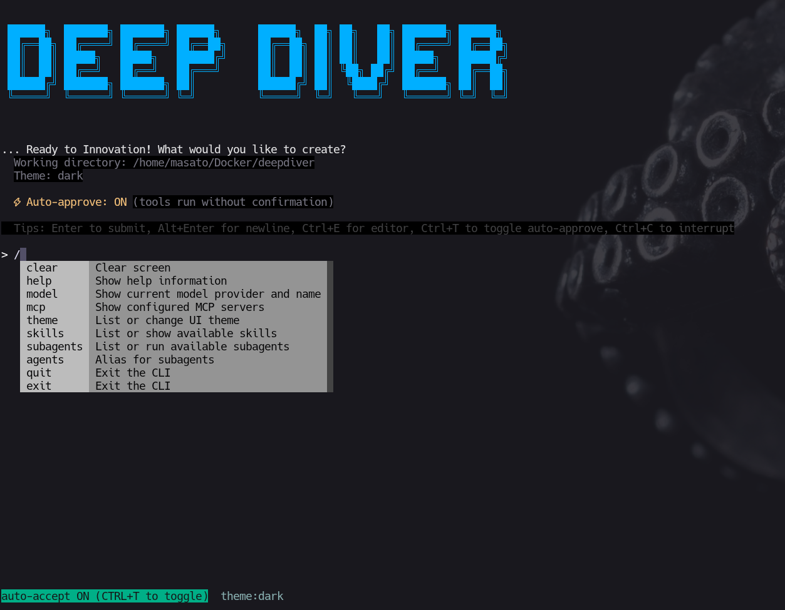

<h1 align="center">Deepdiver CLI</h1>
<p align="center">AWS Strands Agents SDK を用いた対話型コマンドラインインターフェース</p>
<p align="center">
  
  
  
  
  
  
</p>

## 📌 概要

Deepdiver CLI は、AI エージェントと協働してタスクを実行するための対話型 CLI です。複数エージェントの管理、SubAgents、MCP、Skills を使った拡張に対応します。

<p align="center">
  
</p>

## ✨ 機能概要

- エージェントと対話しながらタスクを実行
- 複数エージェントのプロファイル管理
- SubAgents による専門タスクの委譲
- MCP (Model Context Protocol) による外部ツール連携
- Skills による手順の再利用

## ✅ 必要要件

- Python 3.9+
- ネットワーク接続（各モデルプロバイダを使う場合）
- 必要に応じて API キー（Bedrock / OpenAI / Anthropic / Gemini など）
- 音声入力（/voice）を使う場合:
  - Linux（必須対応）
  - `whisper.cpp` の CLI バイナリ
  - 録音ツール: `ffmpeg` または `arecord`

## 🧩 セットアップ

### インストール

```bash
pip install --upgrade pip
pip install -e .
```

`uv` を利用する場合:

```bash
uv pip install -e .
```

### 主要依存パッケージ

- `strands-agents>=0.2.0` - Strands Agents SDK
- `strands-agents-tools>=0.2.0` - Strands ツールセット
- `boto3>=1.34.0` - Amazon Bedrock など AWS 連携向け
- `openai` - OpenAI API クライアント
- `pandas>=2.0.0` - データ分析
- `rich>=13.0.0` - リッチなターミナル出力
- `prompt-toolkit>=3.0.52` - 対話型入力
- `python-dotenv` - 環境変数管理
- `mcp` - Model Context Protocol サポート
- `requests` - HTTP リクエスト
- `tabulate>=0.9.0` - テーブル表示

## 🔧 環境変数（モデル設定）

### 基本

```bash
export STRANDS_MODEL_PROVIDER=bedrock
export STRANDS_MODEL_CONFIG='{"model_id": "anthropic.claude-3-5-sonnet-20241022-v2:0", "region_name": "us-east-1"}'
```

- `STRANDS_MODEL_PROVIDER` 未指定の場合は、Strands Agent 側のデフォルト設定が利用されます。
- `STRANDS_MODEL_CONFIG` は JSON 文字列または JSON ファイルパスを指定できます。
- `.env` を利用する場合は `python-dotenv` により自動で読み込まれます。

### プロバイダ別の補助環境変数

- Bedrock: `BEDROCK_MODEL_ID` / `STRANDS_MODEL_ID`, `BEDROCK_REGION` / `AWS_REGION`
- OpenAI: `OPENAI_MODEL` / `OPENAI_MODEL_ID`, `OPENAI_API_KEY`, `OPENAI_BASE_URL`
- Anthropic: `ANTHROPIC_MODEL`, `ANTHROPIC_API_KEY`
- Ollama: `OLLAMA_MODEL` / `OLLAMA_MODEL_ID`, `OLLAMA_HOST`
- Gemini: `GEMINI_MODEL` / `GEMINI_MODEL_ID`, `GOOGLE_API_KEY` / `GEMINI_API_KEY`

### 音声入力（/voice）用の環境変数（whisper.cpp）

Linuxでのローカル音声入力は `whisper.cpp` CLI を使います。`.env` で設定可能です。

```env
# whisper.cpp CLI バイナリ（必須: 実行ファイルのフルパス）
DEEPDIVER_WHISPER_BIN=/path/to/whisper.cpp/build/bin/whisper-cli
DEEPDIVER_WHISPER_CMD="{bin} -m {model} -f {audio} -l ja -otxt -of {out}"

# モデル設定（未指定なら ggml-base.bin）
DEEPDIVER_WHISPER_MODEL=ggml-small.bin
DEEPDIVER_WHISPER_MODEL_DIR=~/.deepdiver/models/whisper

# 録音設定
DEEPDIVER_VOICE_SECONDS=20
DEEPDIVER_VOICE_RECORDER=ffmpeg

# 無音自動停止（ffmpegのみ）
DEEPDIVER_VOICE_SILENCE_SECONDS=2
DEEPDIVER_VOICE_SILENCE_NOISE=-40dB
```

補足:
- `DEEPDIVER_WHISPER_BIN` はディレクトリではなく **実行ファイル** を指定してください。
- モデルが存在しない場合は自動ダウンロードします。
- `ffmpeg` を使うと **無音検知で自動停止**が可能です。
参考: 
Whieper.cppのインストールやモデルのダウンロード方法、実行方法は以下のサイトを参考にしてみてください。
[Qiita: 音声認識　Whisper.cppを使ってみた](https://qiita.com/2001at/items/77b243c56743f0baf889)

<details>
<summary>設定例（.env）</summary>

#### OpenAI API

```env
STRANDS_MODEL_PROVIDER=openai
OPENAI_MODEL=gpt-4o-mini
OPENAI_API_KEY=sk-your-openai-key
STRANDS_MODEL_CONFIG='{"model_id": "gpt-4o-mini", "params": {"temperature": 0.2}}'
```

#### OpenAI互換（LiteLLMなど）

```env
STRANDS_MODEL_PROVIDER=openai
OPENAI_MODEL_ID=gpt-4o-mini
OPENAI_API_KEY=your-api-key
OPENAI_BASE_URL=http://localhost:4000/v1
# STRANDS_MODEL_CONFIG='{"client_args": {"api_key": "your-api-key", "base_url": "http://localhost:4000/v1"}, "model_id": "gpt-4o-mini"}'
```

#### Gemini

```env
STRANDS_MODEL_PROVIDER=gemini
GEMINI_MODEL_ID=gemini-2.5-flash
GOOGLE_API_KEY=your-google-api-key
# STRANDS_MODEL_CONFIG='{"client_args": {"api_key": "your-google-api-key"}, "model_id": "gemini-2.5-flash", "params": {"temperature": 0.7, "max_output_tokens": 2048}}'
```

#### Ollama

```env
STRANDS_MODEL_PROVIDER=ollama
OLLAMA_MODEL_ID=llama3.1
OLLAMA_HOST=http://localhost:11434
# STRANDS_MODEL_CONFIG='{"model_id": "llama3.1", "host": "http://localhost:11434"}'
```

</details>

## 🔔 通知フック

エージェントの応答が完了してユーザー操作に戻るタイミングで、任意のコマンドを実行できます。

- 環境変数 `notify` / `NOTIFY` / `DEEPDIVER_NOTIFY` を利用
- 形式は JSON 配列（コマンド + 引数）

```env
notify=["cvlc","~/.claude/assets/haneda.mp3","--intf","dummy","--play-and-exit"]
```

## ▶️ 使い方

### 起動

```bash
# モジュールとして実行
python -m deepdiver

# uv を使用する場合
uv run python -m deepdiver

# インストール後はコマンドとして実行可能
deepdiver
# または
deepdiver-cli
```

### CLIオプション（例）

```bash
# エージェントを指定して起動（デフォルト: agent）
deepdiver --agent my-agent

# ツール使用時の承認を自動化（人間の確認なしで実行）
deepdiver --auto-approve

# 利用可能なエージェント一覧を表示
deepdiver list

# エージェントをリセット
deepdiver reset --agent my-agent

# 別のエージェントからプロンプトをコピーしてリセット
deepdiver reset --agent my-agent --target source-agent

# ヘルプを表示
deepdiver help

# tmuxベースの開発チームを起動
deepdiver team start --roles team-lead,coder,reviewer
```

### キーボードショートカット

- `Enter` - 入力を送信
- `Alt+Enter` - 改行を挿入
- `Ctrl+E` - エディタを開く
- `Ctrl+T` - 自動承認モードの切り替え
- `Ctrl+C` - 実行を中断

### 音声入力（/voice）

`/voice` コマンドで録音し、whisper.cpp で文字起こしした結果を次の入力欄に挿入します。

```bash
/voice 10
```

- 引数は最大録音秒数（未指定時は `DEEPDIVER_VOICE_SECONDS` を使用）
- `ffmpeg` + `DEEPDIVER_VOICE_SILENCE_SECONDS` を設定すると、無音が続いたら自動停止します

## 🗂️ エージェント管理

CLI は複数のエージェントプロファイルを管理できます。各エージェントは `~/.deepdiver/<agent-name>/` に保存され、独立したメモリとプロンプト設定を持ちます。

```bash
deepdiver list

deepdiver reset --agent my-agent

deepdiver reset --agent my-agent --target source-agent
```

## 👥 Team（tmux協調）

tmux を使って複数の Deepdiver ワーカーを並列起動し、ロール間でメッセージ通信できます。

```bash
# 1) セッション開始（tmuxに3ペイン作成）
deepdiver team start --roles team-lead,coder,reviewer

# 2) team-leadペインにアタッチして対話
tmux attach -t deepdiver-<session_id>
# team-leadペインで:
#   @coder 実装方針を作って
#   @reviewer コードレビュー観点を整理して

# 3) 外部から送信する場合（team-lead から coder へ）
deepdiver team send --session <session_id> --from team-lead --to coder -- "このリポジトリをレビューして"

# 4) 返信確認
deepdiver team inbox --session <session_id> --role team-lead --tail 20

# 5) 停止
deepdiver team stop --session <session_id>
```

詳細仕様:
- `docs/team-architecture-ja.md`

## 🧠 SubAgents

Deepdiver は **SubAgents（サブエージェント）** の仕組みで、専門的なタスクを独立したエージェントに委譲できます。SubAgents は Markdown ファイル（YAML frontmatter 付き）として定義され、**progressive disclosure** 方式で管理されます。

### ディレクトリ構成

- ユーザー SubAgents: `~/.deepdiver/subagents/`
- プロジェクト SubAgents: `.deepdiver/subagents/`（git ルート配下、同名があればこちらが優先）

### 作成と実行

```bash
# ユーザー SubAgent を作成
deepdiver subagents create my-subagent

# プロジェクト SubAgent を作成
deepdiver subagents create my-subagent --project

# SubAgent を直接実行
deepdiver subagents run my-subagent --agent agent -- "タスクの説明"

# 以前の実行を再開
deepdiver subagents resume <run_id> my-subagent --agent agent -- "続きのタスク"
```

### 定義ファイルの形式

```md
---
name: code-reviewer
description: コードレビューを専門に行うサブエージェント
tools: file_read,editor
enable_skills: true
---

# Code Reviewer

## Purpose

コードレビューを専門に行い、バグや改善点を指摘します。

## When to Use

- コードの品質チェックが必要な場合
- セキュリティ問題の検出が必要な場合

## Instructions

1. コードを読み込み、構造を理解する
2. バグ、セキュリティ問題、パフォーマンス問題を検出
3. 改善提案を具体的に提示する
```

## 🔌 MCP (Model Context Protocol)

Deepdiver は **MCP (Model Context Protocol)** をサポートしており、外部ツールやサービスをエージェントに統合できます。MCP サーバーはエージェントごとに設定され、stdio、SSE (Server-Sent Events)、Streamable HTTP の各トランスポートをサポートします。

### 設定方法

**設定ファイルの場所**: `~/.deepdiver/<agent-name>/mcp.json`

```json
{
  "mcpServers": {
    "taivily": {
      "command": "npx",
      "args": ["-y", "@modelcontextprotocol/server-taivily"],
      "env": {
        "TAIVILY_API_KEY": "your-api-key"
      }
    }
  }
}
```

### トランスポートタイプ

- stdio（標準入出力）
- SSE (Server-Sent Events)
- Streamable HTTP

### MCP サーバーの無効化

```json
{
  "mcpServers": {
    "server-name": {
      "command": "...",
      "disabled": true
    }
  }
}
```

### CLI 内での確認

```
/mcp
```

## 🧰 Skills

Deepdiver は Agent Skills の仕組みを使って、専門的な手順やワークフローを追加できます。Skills は `SKILL.md` を含むフォルダとして管理され、必要なときにだけ読み込まれる **progressive disclosure** 方式です。

### ディレクトリ構成

- ユーザー技能: `~/.deepdiver/<agent>/skills/`
- プロジェクト技能: `.deepdiver/skills/`（git ルート配下）

### 使い方

- `/skills` でスキル一覧を表示
- `/skills` → Tab で `$skill ` を挿入して続けて入力
- `$plan 移行計画を立案してください。` のように指定すると、該当スキルの `SKILL.md` を読み込みます
- `$` を付けない場合は、LLM が文脈から自動選択します（該当時に SKILL.md を読む前提）

## 🧩 デフォルトツール

CLI には以下のデフォルトツールが組み込まれています。

- `file_read` - ファイルの読み込み
- `file_write` - ファイルの書き込み
- `editor` - エディタでの編集
- `shell` - シェルコマンドの実行
- `http_request` - HTTP リクエストの送信
- `environment` - 環境変数の取得
- `calculator` - 計算の実行
- `current_time` - 現在時刻の取得
- `filter_csv_data` - CSV データのフィルタリング

MCP サーバーが設定されている場合、追加のツールも利用可能です。
